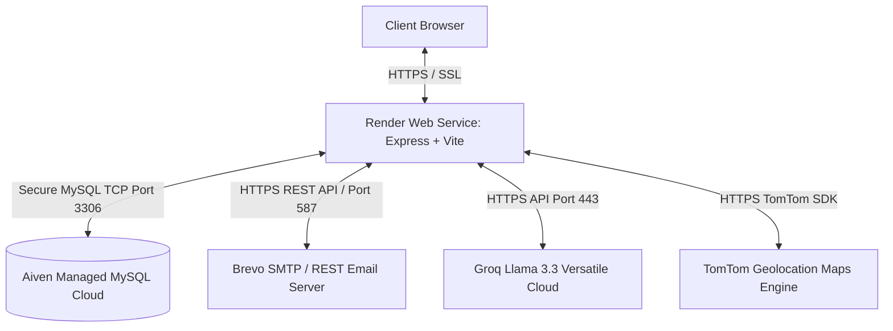
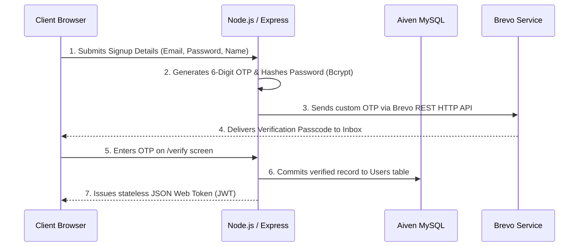
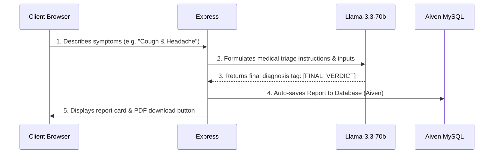
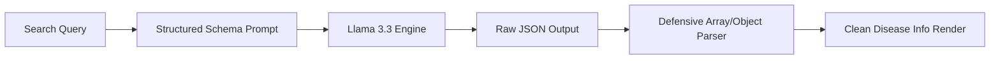

# Chikitsa: Comprehensive Technical & Architectural Blueprint

Welcome to the definitive architectural and workflow manual for **Chikitsa**, a state-of-the-art, secure, clinical intelligence platform. This document outlines the end-to-end cloud deployment architecture, third-party platform integrations, and granular step-by-step workflows for each clinical module.

---

## 🏗️ End-to-End Cloud Deployment Architecture

Chikitsa is built to scale in the cloud, leveraging a distributed microservices network integrated into a high-performance monolithic core.

### 1. Web Hosting & Compute: **Render**
*   **Platform**: Deployed as an auto-scaling **Render Web Service** running a Node.js/Express process.
*   **Production Bundling**: Vite compiles the React code into optimized, minified static assets (`dist` folder). The Node.js server dynamically serves these assets using `express.static()` while concurrently acting as the core REST API backend.
*   **Network Security**: Render handles the SSL/TLS termination, exposing a secure HTTPS endpoint (`https://...`) to the client browser.

### 2. Database Hosting: **Aiven Cloud**
*   **Platform**: Powered by **Aiven for MySQL**, a fully-managed, high-availability cloud database cluster.
*   **Connection Resilience**: 
    *   Express establishes a secure, persistent **Connection Pool** utilizing the `mysql2/promise` driver.
    *   On startup, the server parses the dynamic environment variable `DATABASE_URL` or `MYSQL_URI` to extract secure cluster details (hostname, user, password, and port).
    *   Aiven handles automatic scaling, point-in-time recovery, and cluster backups, ensuring the database remains completely isolated and protected.

### 3. Transactional Mail Service: **Brevo (formerly Sendinblue)**
*   **Infrastructure**: Hosted via Brevo's global high-deliverability mail servers.
*   **Render-Safe Dual Dispatch**:
    *   Render's hosting network restricts standard outgoing mail ports (like 25, 465, or 587) to eliminate spam.
    *   To overcome this, Chikitsa implements a resilient **Dual Dispatch Engine**:
        1.  **Primary Channel**: Bypasses SMTP blocks entirely by sending emails via **Brevo's REST HTTP API** over secure HTTPS Port 443.
        2.  **Secondary Channel**: Automatically fails over to standard **SMTP Transporter** using `smtp-relay.brevo.com` over Port 587 if the API encounters rate limitations.

---

## 🔄 Granular Section Workflows

---

### Section A: Authentication & OTP Verification Flow
This module ensures clinical database records are securely matched only to verified individuals.

1.  **Registration Request**: The user enters their details on the `/signup` page. Password hashing is executed instantly on the server using `bcryptjs` (salted with 10 rounds).
2.  **OTP Generation**: Rather than saving unverified users to the core database, the server generates a cryptographically secure 6-digit numeric token and stores it temporarily in an in-memory `tempUsers` Map.
3.  **Delivery**: The server invokes `sendVerificationEmail()`. If `BREVO_API_KEY` is present, it constructs a payload containing the secure HTML template and posts it directly to `https://api.brevo.com/v3/smtp/email`. If the API fails, `nodemailer` starts the SMTP transporter relay.
4.  **Verification**: The user enters the code on `/verify`. The server checks the `tempUsers` map. If verified, the user is permanently committed to Aiven MySQL, and a stateless JWT signed with a secure `JWT_SECRET` key is returned, establishing the active session.

---

### Section B: Automated Health Check Triage Chat
This module delivers lightning-fast clinical triage without making the user wait through excessive conversation.

1.  **Symptom Intake**: The user types a description of their symptoms.
2.  **Engine Dispatch**: The frontend triggers a socket dispatch to the REST API, sending the dialogue history along with any user biometric context (e.g., known allergies, past surgeries).
3.  **Prompt Triage Execution**: The server wraps the dialogue inside a highly structured prompt forcing strict rules:
    *   *No Chattiness*: Skip intros and go straight to the facts.
    *   *Skip to Final*: If the user input contains more than 5 words or identifiable diagnostic terms (e.g., sinus headache, high fever), immediately issue a `[FINAL_VERDICT]` block rather than asking follow-up questions.
4.  **Clinical Synthesis**: The Llama 3.3 engine parses the information, identifies the specialty clinician needed, maps the condition, and formats generic medicines.
5.  **Synchronization**: If a `[FINAL_VERDICT]` is present, the app automatically triggers a background POST request to `/api/reports`, storing the clinical findings permanently in Aiven MySQL, while presenting the user with an option to download a compiled PDF using the client-side `jsPDF` engine.

---

### Section C: Clinical Disease Analytics (Disease Info)
A clinical knowledge graph displaying a thorough pathological breakdown of infections, allergies, and chronic diseases.

1.  **Search Lookup**: The user searches for a disease (e.g., "Malaria").
2.  **Structured Output Request**: The application requests a highly detailed JSON object containing strict parameters: `name`, `symptoms`, `causes`, `prevention`, `treatment`, `category`, `urgency`, `types`, `homeRemedies`, and `recommendedTablet`.
3.  **Defensive Rendering Engine**: AI models occasionally output arrays of text or nested objects (like `{ name: 'Paracetamol', dosage: '500mg' }`) instead of raw strings. To prevent React from throwing the fatal **Minified React Error #31**, Chikitsa processes all outputs through a safe parser:
    *   *Objects*: Checks if properties like `recommendedTablet` or `precautions` are objects, and extracts their nested text fields.
    *   *Arrays*: If lists are returned as arrays, they are programmatically joined into clean sentences using `array.join(', ')` to eliminate brackets and quotes from the UI.

---

### Section D: Pharmaceutical Knowledge Search
A verified pharmaceutical database explaining medication logic, intake procedures, and black-box safety warnings.

1.  **Search Intake**: The user searches for a generic medication name (e.g., "Metformin").
2.  **Safety Profile Extraction**: The Groq AI acts as a clinical pharmacologist, extracting the chemical's primary indications, standard adult protocols, safety checklists, and black-box clinical warnings.
3.  **Visual Alerts**: The frontend isolates the warning profile. If the AI flags severe contraindications, the app triggers a bold, red **Black Box Warning** alert card in the UI, emphasizing critical risk areas.

---

### Section E: Nearby Care Geolocation Maps
Matches matched clinical specialists (e.g., Gastroenterologists or Cardiologists) to real-world geolocation markers.

1.  **Provider Request**: Upon diagnosing a condition, the user clicks **"Find Specialists"**.
2.  **Geolocation Query**: The app calls the external **TomTom Maps API** using the user's current city/coordinates (`VITE_TOMTOM_API_KEY`) to fetch latitude and longitude bounds for medical facilities.
3.  **Interactive Rendering**: The coordinates are mapped in the client browser using the **Leaflet map engine**. Leaflet fetches OpenStreetMap graphical map tiles, placing precise markers pointing to local hospitals, specialty clinics, and emergency care facilities.

---

### Section F: Biometric Analytics Telemetry
Allows users to log and monitor vital clinical metrics over time.

1.  **Biometric Input**: The user logs a biometric metric (e.g., blood pressure, heart rate, blood sugar, or temperature) from the dashboard.
2.  **Secure Storage**: The data is sent to the Express API with the user's JWT signature, where it is instantly saved to the database.
3.  **Telemetry Rendering**: Recharts queries the raw values from the database and renders dynamic interactive line graphs. Vitals are graphed chronologically, enabling users to monitor their health trends and export their biometrics as clinical history for their doctors.

---

> [!IMPORTANT]
> **Developer Deployment Notice**
> To run Chikitsa in production, ensure your hosting dashboard (e.g., Render) is populated with these secure environment variables:
> *   `GROQ_API_KEY`: Groq Cloud Access Token.
> *   `DATABASE_URL` / `MYSQL_URI`: Connection string pointing to your secure Aiven MySQL cluster.
> *   `JWT_SECRET`: Secure encryption key for signing tokens.
> *   `BREVO_API_KEY`: API credential for bypassing mail port blocks.
> *   `EMAIL_USER` / `EMAIL_PASS`: SMTP fallback details.
