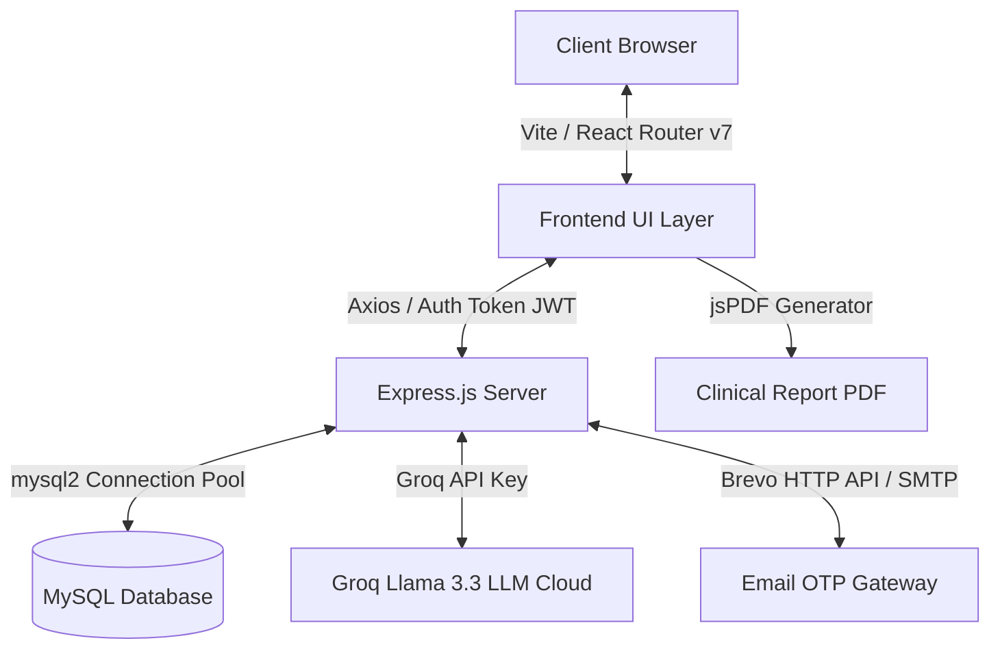

# Chikitsa: Comprehensive Technical Overview

Welcome to the technical overview of **Chikitsa**, a state-of-the-art, secure, and highly stable clinical intelligence platform designed to deliver professional-grade health assessments, pharmaceutical search, and personalized patient management.

This document describes the end-to-end architecture, programming languages, framework stacks, APIs, and key features of Chikitsa.

---

## 🏗️ Architectural Overview

Chikitsa is built on a modern **Single Page Application (SPA)** architecture, powered by a unified **Node.js/Express** backend and a **Vite + React** frontend. It implements robust clinical-grade security, full-stack state synchronization, and an extremely responsive design system optimized for high performance.

---

## 💻 Tech Stack & Frameworks

### 1. The Frontend Layer
Built using standard **HTML5** and **JavaScript (React v19)**, the interface utilizes the latest premium web styling and animation techniques:

*   **Build Tool**: [Vite](https://vite.dev/) (provides instant HMR and high-performance production bundling).
*   **Styling Engine**: [Tailwind CSS v4](https://tailwindcss.com/) with a dedicated, custom clinical aesthetic configuration (emerald, medical-blue, and slate color palettes).
*   **UI Components**: Customized glassmorphism card templates, responsive tables, and input elements.
*   **Icons**: [Lucide React](https://lucide.dev/) (high-quality clinical, anatomical, and navigation vector icons).
*   **Animations**: [Framer Motion](https://www.framer.com/motion/) (`motion/react`) for custom spring-loaded transitions, modal slide-ins, and state-change animations.
*   **Interactive Maps**: [Leaflet](https://leafletjs.com/) and `react-leaflet` to query and display nearby care providers, emergency rooms, and clinics on interactive maps with OSM tiles.
*   **Telemetry Analytics**: [Recharts](https://recharts.org/) for rendering real-time user-logged vitals, such as blood pressure trends, heart rate frequency, blood oxygen levels, and body mass index.

### 2. The Backend Layer
A monolithic, robust, and lightning-fast REST API server:

*   **Runtime Environment**: [Node.js](https://nodejs.org/) (JavaScript runtime).
*   **Framework**: [Express.js](https://expressjs.com/) for routing, request sanitization, authentication, and serving static files.
*   **Security Protocol**:
    *   **Password Hashing**: `bcryptjs` (secure blowfish-based password salting and hashing).
    *   **Session Management**: `jsonwebtoken` (JWT) utilizing custom stateless signature algorithms to manage authenticated user scopes.

### 3. Database Layer
*   **SQL Database Engine**: **MySQL** (supported via `mysql2/promise` with robust connection pooling).
*   **Deployment Versatility**: The application automatically parses dynamic connection strings (e.g., `DATABASE_URL` or `MYSQL_URI`) on startup, enabling seamless production deployments on services such as Aiven, AWS RDS, PlanetScale, or local root instances.

---

## 🔌 API & Integration Layer

Chikitsa leverages powerful third-party services to handle advanced AI processing and secure communications:

### 1. Groq Clinical NLP Core (`groq-sdk`)
To escape the high latency and low reliability of Gemini, the entire AI architecture has been migrated to **Groq**.
*   **Model**: `llama-3.3-70b-versatile` (extremely low latency, high accuracy, and medical reasoning capability).
*   **Formatting**: Standardized system instructions combined with forced `response_format: { type: "json_object" }` structures to guarantee clinical schema compliance.
*   **Stability Wrappers**: Implemented a comprehensive **Defensive Rendering Pipeline** across all modules to handle nested JSON objects (extracting `name` or `description` tags safely) preventing frontend React crashes.

### 2. Multi-Channel Identity Verification (Email OTP)
*   **Brevo HTTP API**: Direct integration using fetch requests over HTTPS to bypass blocked SMTP ports on hosting environments (like Render).
*   **Nodemailer SMTP Fallback**: Automatic, resilient failover to standard SMTP transporters (supporting Gmail, Outlook, and custom relays).

### 3. Client-Side Clinical Report Compiler (`jspdf`)
*   Generates instant **Clinical Reports** in **PDF** format entirely on the client-side.
*   Uses `jspdf` and `jspdf-autotable` to format parsed symptoms, suspected diseases, and physician specialist matching parameters.

---

## 📂 Core App Features & Pages

| Page/Module | Purpose & Function | Technologies Used |
| :--- | :--- | :--- |
| **Dashboard** | User portal showing biometric vitals, active medications, clinical history, and system latency telemetry. | Recharts, Lucide React, Framer Motion |
| **Health Check** | Fast clinical triage chat assistant that diagnoses symptoms in 1-2 steps and recommends specialists. | Groq SDK, React state, Custom fast prompts |
| **Disease Info** | Deep exploration of conditions, etiology, types, home remedies, and recommended tablets. | Groq SDK, Safe object-rendering wrappers |
| **Pharma Knowledge** | Verified pharmaceutical search engine providing dosages, precautions, and black-box warnings. | Groq SDK, defensive list formatting |
| **Nearby Care** | Geolocation interactive map showing medical specialists and care hospitals. | Leaflet, React Leaflet, OpenStreetMap |
| **Analytics Vault** | Interactive biometric tracking showing patient health trends over time. | Recharts, vitals database logging |
| **Auth Gateway** | High-security sign-up, sign-in, and verification flow utilizing custom OTP. | JWT, Bcrypt, Brevo/Nodemailer API |

---

> [!IMPORTANT]
> **Clinical Disclaimer**
> Chikitsa is an educational, preliminary clinical awareness tool. All synthesized results are derived from neural language models and broad datasets. It does not provide medical prescriptions, and all conditions must be verified by a treating physician.
